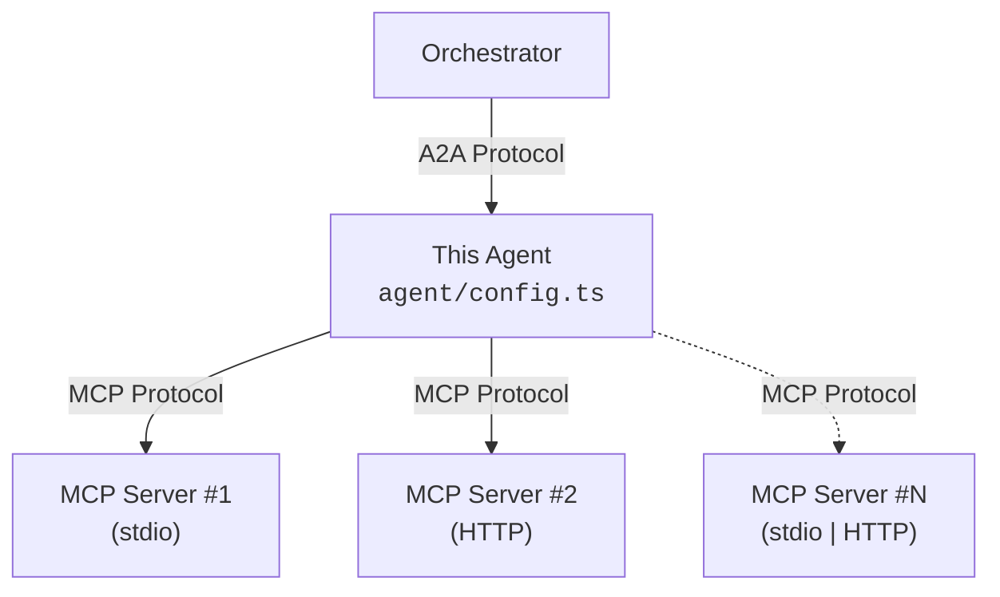

# A2A Agent Template

An [Agent-to-Agent (A2A) protocol](https://github.com/google/A2A) agent template built with TypeScript, Express, and the Vercel AI SDK.

Supports local tools, [MCP](https://modelcontextprotocol.io/) servers (stdio and Streamable HTTP), and exposes a configurable agent card.

## Quick Start

### Prerequisites

- Node.js 24+ (or Docker)
- Anthropic API key

### Installation

```bash
npm install
cp .env.sample .env
# Add your ANTHROPIC_API_KEY to .env
```

### Development

```bash
npm run dev
```

The agent starts on port `4000` by default.

## Customize Your Agent

Configuration is split into two files: **`package.json`** for declarative values and **`src/agent/config.ts`** for anything that requires code.

### `package.json` — identity, role, skills, behavior

Edit the `a2a` key to define who your agent is and what it can do:

```jsonc
{
  "name": "a2a-travel-agent",
  "description": "AI travel planning agent with weather and flight tools",
  "a2a": {
    // Optional — omit if not needed
    "provider": { "organization": "Wanderlust Travel Co.", "url": "https://wanderlust.travel" },
    "documentationUrl": "https://wanderlust.travel/docs/agent",

    // Agent persona (used in the system prompt)
    "role": "a travel planning assistant that helps users research destinations, check weather forecasts, and find flights",
    "constraints": [
      "Never book or purchase anything on behalf of the user — only provide recommendations",
      "Always include weather context when suggesting travel dates",
      "Prices are estimates and may change — remind the user to verify before booking"
    ],
    "examples": [
      {
        "user": "I want to go somewhere warm in February.",
        "agent": "Let me check weather forecasts for a few popular warm destinations in February. I'll look at Cancún, Bali, and Cape Town to compare."
      },
      {
        "user": "What's the weather like in Tokyo next week?",
        "agent": "I'll pull up the forecast for Tokyo for the next 7 days."
      }
    ],

    // Agent behavior
    "behavior": { "maxSteps": 10, "temperature": 0.7 },

    // Skills — advertised in the agent card AND used as responsibilities in the system prompt
    "skills": [
      {
        "id": "weather-lookup",
        "name": "Weather Forecasts",
        "description": "Look up current conditions and multi-day weather forecasts for any city worldwide",
        "tags": ["weather", "forecast", "travel"],
        "examples": ["What's the weather in Paris this weekend?", "Will it rain in Bali next week?"]
      },
      {
        "id": "trip-planner",
        "name": "Trip Planning",
        "description": "Suggest destinations, build itineraries, and recommend travel dates based on weather and preferences",
        "tags": ["travel", "itinerary", "planning"],
        "examples": ["Plan a 5-day trip to Portugal", "Where should I go for a beach vacation in March?"]
      }
    ]
  }
}
```

### `src/agent/config.ts` — code configuration

| Export | What it controls |
| --- | --- |
| `createModel()` | LLM provider and model (swap Anthropic/Bedrock/OpenAI/etc.) |
| `localTools` | In-process tools (defined with AI SDK `tool()` + Zod) |
| `mcpServers` | MCP servers to connect to (stdio or Streamable HTTP) |

Everything else lives in `src/agent/util.ts` — framework plumbing you shouldn't need to touch.

### Adding an MCP Server

Add entries to the `mcpServers` array in `src/agent/config.ts`:

```typescript
// Local stdio server
{
  transport: 'stdio',
  name: 'Open-Meteo Weather',
  description: 'Real-time weather data and forecasts',
  command: 'npx',
  args: ['open-meteo-mcp-server'],
},

// Remote Streamable HTTP server
{
  transport: 'http',
  name: 'My Remote Service',
  description: 'Tools from a remote MCP server',
  url: 'https://mcp.example.com/mcp',
},
```

MCP tools are automatically discovered and converted to AI SDK tools at startup.

### Adding a Local Tool

Define tools directly in the `localTools` object in `src/agent/config.ts`:

```typescript
import { tool } from 'ai';
import { z } from 'zod';

export const localTools: ToolSet = {
  getCompanyInfo: tool({
    description: 'Get information about the company',
    inputSchema: z.object({
      topic: z.string().describe('Topic to look up'),
    }),
    execute: async ({ topic }) => {
      return { topic, info: 'ACME Corp is ...' };
    },
  }),
};
```

## Environment Variables

| Variable | Required | Default | Description |
| --- | --- | --- | --- |
| `MODEL_ID` | Yes | - | Model ID matching the provider in config (e.g. `claude-haiku-4-5`) |
| Provider API key | Yes | - | API key for your provider (e.g. `ANTHROPIC_API_KEY`) |
| `PORT` | No | `4000` | Port the server listens on |
| `LOG_LEVEL` | No | `INFO` | Logging level |

## A2A Endpoints

| Endpoint | Description |
| --- | --- |
| `GET /.well-known/agent-card.json` | Agent card with dynamic URLs |
| `POST /a2a/jsonrpc` | JSON-RPC 2.0 transport |
| `POST /a2a/rest` | HTTP+JSON (REST) transport |

### Example

```bash
curl -X POST http://localhost:4000/a2a/jsonrpc \
  -H "Content-Type: application/json" \
  -d '{
    "jsonrpc": "2.0",
    "method": "message/send",
    "params": {
      "message": {
        "kind": "message",
        "messageId": "msg-1",
        "role": "user",
        "parts": [{ "kind": "text", "text": "Hello, how can you help me?" }]
      }
    },
    "id": 1
  }'
```

## Architecture


