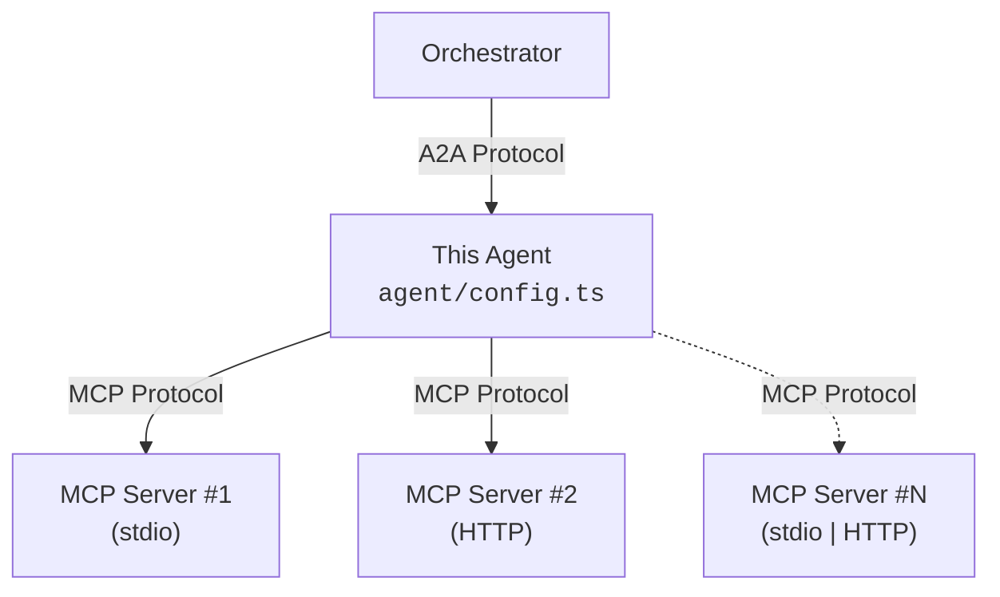

# A2A Agent Template

An AI-powered [Agent-to-Agent (A2A) protocol](https://github.com/google/A2A) agent template built with TypeScript, Express, and the Vercel AI SDK.

Supports local tools, [MCP](https://modelcontextprotocol.io/) servers (stdio and Streamable HTTP), and exposes a configurable agent card.

## Quick Start

### Prerequisites

- Node.js 24+ (or Docker)
- Anthropic API key

### Installation

```bash
npm install
cp .env.sample .env
# Add your ANTHROPIC_API_KEY to .env
```

### Development

```bash
npm run dev
```

The agent starts on port `4000` by default.

## Customize Your Agent

All configuration lives in **`src/agent/config.ts`**:

| Section | What it controls |
| --- | --- |
| `agentConfig` | Provider name, URLs shown in the agent card |
| `createModel` | LLM provider and model (swap Anthropic/Bedrock/OpenAI/etc.) |
| `instructions` | System prompt — the agent's personality and behavior |
| `agentBehavior` | Max tool-loop steps, temperature |
| `skills` | Skills advertised in the agent card |
| `localTools` | In-process tools (defined with AI SDK `tool()`) |
| `mcpServers` | MCP servers to connect to (stdio or Streamable HTTP) |

### Adding an MCP Server

Add entries to the `mcpServers` array in `src/agent/config.ts`:

```typescript
// Local stdio server
{
  transport: 'stdio',
  name: 'Open-Meteo Weather',
  description: 'Real-time weather data and forecasts',
  command: 'npx',
  args: ['open-meteo-mcp-server'],
},

// Remote Streamable HTTP server
{
  transport: 'http',
  name: 'My Remote Service',
  description: 'Tools from a remote MCP server',
  url: 'https://mcp.example.com/mcp',
},
```

MCP tools are automatically discovered and converted to AI SDK tools at startup.

### Adding a Local Tool

Define tools directly in the `localTools` object in `src/agent/config.ts`:

```typescript
import { tool } from 'ai';
import { z } from 'zod';

export const localTools: ToolSet = {
  getCompanyInfo: tool({
    description: 'Get information about the company',
    inputSchema: z.object({
      topic: z.string().describe('Topic to look up'),
    }),
    execute: async ({ topic }) => {
      return { topic, info: 'ACME Corp is ...' };
    },
  }),
};
```

## Configuration

| Variable | Required | Default | Description |
| --- | --- | --- | --- |
| `MODEL_ID` | Yes | - | Model ID matching the provider in config (e.g. `claude-haiku-4-5`) |
| Provider API key | Yes | - | API key for your provider (e.g. `ANTHROPIC_API_KEY`) |
| `PORT` | No | `4000` | Port the server listens on |
| `LOG_LEVEL` | No | `INFO` | Logging level |

## A2A Endpoints

| Endpoint | Description |
| --- | --- |
| `GET /.well-known/agent-card.json` | Agent card with dynamic URLs |
| `POST /a2a/jsonrpc` | JSON-RPC 2.0 transport |
| `POST /a2a/rest` | HTTP+JSON (REST) transport |

### Example

```bash
curl -X POST http://localhost:4000/a2a/jsonrpc \
  -H "Content-Type: application/json" \
  -d '{
    "jsonrpc": "2.0",
    "method": "message/send",
    "params": {
      "message": {
        "kind": "message",
        "messageId": "msg-1",
        "role": "user",
        "parts": [{ "kind": "text", "text": "Hello, how can you help me?" }]
      }
    },
    "id": 1
  }'
```

## Architecture


